# ClawUI Starter Kit

A starter kit for building AI-powered applications with [CopilotKit](https://copilotkit.ai) and optional [OpenClaw](https://openclaw.ai) integration.


## Quickstart

```bash
# 1. Install dependencies
npm install

# 2. Set up environment
cp .env.example .env
# Edit .env with your OpenAI API key

# 3. Run
npm run dev
```

Open [http://localhost:3000](http://localhost:3000). You'll see a kanban board demo with a chat sidebar.

## Modes

ClawUI supports three modes, controlled by `CLAWPILOT_MODE` in your `.env`:

| Mode | What it does |
|------|-------------|
| `standalone` | CopilotKit + your LLM only (default) |
| `openclaw` | OpenClaw controls the app via clawg-ui |
| `hybrid` | Both agents -- `@copilot` for your LLM, `@clawpilot` for OpenClaw |

### Standalone (default)

```env
CLAWPILOT_MODE=standalone
NEXT_PUBLIC_CLAWPILOT_MODE=standalone
OPENAI_API_KEY=sk-...
```

### OpenClaw

```env
CLAWPILOT_MODE=openclaw
NEXT_PUBLIC_CLAWPILOT_MODE=openclaw
OPENCLAW_AGENT_URL=http://localhost:18789/v1/clawg-ui
OPENCLAW_AGENT_TOKEN=your-token
```

Requires the clawg-ui plugin on your OpenClaw gateway. See `clawgui/SETUP.md`.

Having auth issues (401/403) with `@clawpilot`? Follow the first-time pairing guide: [`PAIRING-CLAWG-UI.md`](./PAIRING-CLAWG-UI.md).

Gateway on a VPS? See the [Remote Gateway Guide](./docs/REMOTE_GATEWAY.md).

### Hybrid

```env
CLAWPILOT_MODE=hybrid
NEXT_PUBLIC_CLAWPILOT_MODE=hybrid
OPENAI_API_KEY=sk-...
OPENCLAW_AGENT_URL=http://localhost:18789/v1/clawg-ui
OPENCLAW_AGENT_TOKEN=your-token
```

## Use Cases

```mermaid
flowchart LR
    EU["👤 Browser<br/>User"]
    WAU["📱 WhatsApp<br/>User"]

    subgraph system["  Your ClawUI App  "]
        direction TB
        UC1(["Chat with @copilot"])
        UC2(["Chat with @clawpilot"])
        UC3(["Switch agents via @mention"])
        UC4(["Manage board via drag-and-drop"])
        UC5(["View tool execution live"])
        UC6(["Send commands remotely"])
        UC7(["Query app state remotely"])
    end

    LLM["🤖 LLM Provider<br/>(OpenAI, Anthropic)"]
    OC["🔗 OpenClaw Gateway<br/>(clawg-ui)"]

    EU --- UC1 & UC2 & UC3 & UC4 & UC5

    WAU --- UC6 & UC7

    UC1 --- LLM
    UC2 --- OC
    UC6 --- OC
    UC7 --- OC
```



Both channels read and write the same app data through your API routes.

### By Mode

| Use Case | Standalone | OpenClaw | Hybrid |
|----------|:----------:|:--------:|:------:|
| Chat with @copilot (local LLM) | ✅ | — | ✅ |
| Chat with @clawpilot (OpenClaw) | — | ✅ | ✅ |
| @mention agent switching | — | — | ✅ |
| AI executes registered tools | ✅ | ✅ | ✅ |
| Multi-channel access (WhatsApp) | — | ✅ | ✅ |
| Manage board (drag-and-drop) | ✅ | ✅ | ✅ |
| View tool execution status | ✅ | ✅ | ✅ |

---

## Project Structure

```
src/
├── app/           Next.js pages and API routes
├── core/          ClawUI framework (keep this)
│   ├── providers/ Context providers (mode, mention, attribution)
│   ├── components/
│   │   ├── chat/  Chat sidebar and input components
│   │   └── layout/ SplitLayout, WelcomePage
│   ├── hooks/     Shared hooks
│   └── lib/       Agent config, bridge config, types
├── ui/            Base UI atoms (keep this)
└── demo/          Kanban demo (delete to start fresh)
```

---

## Customization

### Getting Started

| Step | Action | How |
|:----:|--------|-----|
| 1 | **Remove the demo** | `rm -rf src/demo/ src/app/api/kanban/` — app falls back to WelcomePage |
| 2 | **Pick a mode** | Set `CLAWPILOT_MODE` in `.env` — `standalone`, `openclaw`, or `hybrid` |
| 3 | **Configure your LLM** | Set `OPENAI_API_KEY` in `.env` (or swap adapter in `src/app/api/copilotkit/route.ts`) |
| 4 | **Connect OpenClaw** *(optional)* | Set `OPENCLAW_AGENT_URL` + `OPENCLAW_AGENT_TOKEN`, then pair device — see [`PAIRING-CLAWG-UI.md`](./PAIRING-CLAWG-UI.md) |
| 5 | **Build your UI** | Create components anywhere in `src/`, import in `src/app/page.tsx` |
| 6 | **Register AI tools** | `useCopilotAction()` in your component — both agents can call them |
| 7 | **Expose app state** | `useCopilotReadable()` in your component — both agents can read it |

See `docs/engineering/2_REMOVING_DEMO.md` for a detailed walkthrough.

### Registering Tools & State

```tsx
import { useCopilotAction, useCopilotReadable } from "@copilotkit/react-core";

useCopilotReadable({
  description: "Current items in the shopping cart",
  value: cartItems,
});

useCopilotAction({
  name: "addToCart",
  description: "Add a product to the shopping cart",
  parameters: [
    { name: "productId", type: "string", description: "Product ID" },
    { name: "quantity", type: "number", description: "Quantity" },
  ],
  handler: async ({ productId, quantity }) => {
    addItem(productId, quantity);
    return `Added ${quantity}x ${productId} to cart`;
  },
});
```

Tools register on mount and deregister on unmount. Both agents (in hybrid mode) automatically see your tools and state.

### Swapping the LLM Provider

Edit `src/app/api/copilotkit/route.ts`:

```typescript
import { OpenAIAdapter } from "@copilotkit/runtime";
const serviceAdapter = new OpenAIAdapter({ model: "gpt-4o" });

// Or Anthropic:
import { AnthropicAdapter } from "@copilotkit/runtime";
const serviceAdapter = new AnthropicAdapter({ model: "claude-3-opus-20240229" });

// Or Groq:
import { GroqAdapter } from "@copilotkit/runtime";
const serviceAdapter = new GroqAdapter({ model: "llama3-70b-8192" });
```

## Documentation

- `docs/product/` -- Product profile and goals
- `docs/engineering/` -- Architecture, modes guide, demo removal, remote gateway setup
- `docs/ai/` -- Agent configuration reference
